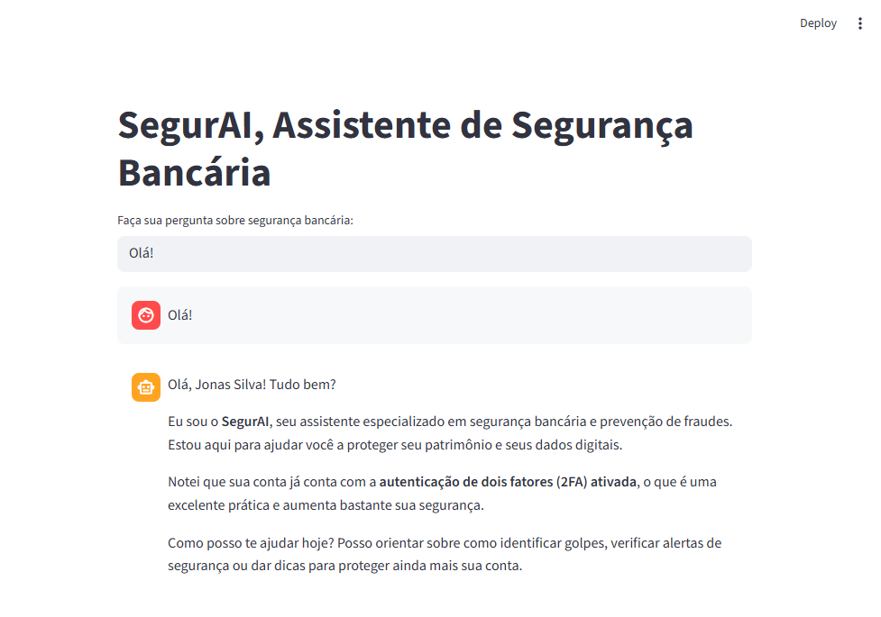

# 🔒 SegurAI - Assistente de Segurança Bancária

Um agente inteligente especializado em segurança bancária e prevenção de fraudes digitais. **SegurAI** orienta usuários a identificar, prevenir e reagir a tentativas de fraude de forma educativa e segura.



---

## 📋 Índice

- [Visão Geral](#visão-geral)
- [Características](#características)
- [Arquitetura](#arquitetura)
- [Requisitos](#requisitos)
- [Configuração](#configuração)
- [Como Usar](#como-usar)
- [Base de Conhecimento](#base-de-conhecimento)
- [Estrutura do Projeto](#estrutura-do-projeto)
- [Segurança e Limitações](#segurança-e-limitações)

---

## 🎯 Visão Geral

### Problema

Usuários de serviços bancários digitais enfrentam crescentes ameaças de fraude: phishing, clonagem de cartão, transações suspeitas e golpes sofisticados. Muitas pessoas não sabem como identificar e proteger-se contra esses ataques.

### Solução

**SegurAI** oferece:
- ✅ Análise de padrões suspeitos em transações
- ✅ Alertas educativos sobre possíveis fraudes
- ✅ Orientações claras para proteger contas e cartões
- ✅ Ensino de boas práticas de segurança digital
- ✅ Validação de transações antes de qualquer ação

### Público-Alvo

Projeto para fins didáticos.

---

## ✨ Características

| Feature | Descrição |
|---------|-----------|
| 🤖 **Agente Inteligente** | Respostas contextalizadas usando LLM |
| 📊 **Base de Conhecimento** | Dados estruturados sobre fraudes e boas práticas |
| 👤 **Contexto do Cliente** | Análise personalizada baseada no perfil do usuário |
| 🛡️ **Anti-Alucinação** | Respostas fundamentadas apenas em dados confiáveis |
| 📱 **Interface Web** | Chatbot intuitivo via Streamlit |
| 🌐 **Integração Ollama** | Execução local do modelo de IA |

---

## 🏗️ Arquitetura

```
┌─────────────────────────────────────────────┐
│           Usuário (Web Browser)             │
└────────────────┬────────────────────────────┘
                 │
┌────────────────▼─────────────────────────────┐
│         Interface Streamlit                  │
│  (Formulário de pergunta + Chat)            │
└────────────────┬─────────────────────────────┘
                 │
┌────────────────▼─────────────────────────────┐
│      Processamento (app.py)                  │
│  • Carregamento de dados                     │
│  • Construção de contexto                    │
│  • Validação de prompts                      │
└────────────────┬─────────────────────────────┘
                 │
    ┌────────────┴───────────────┐
    │                            │
┌───▼──────────────┐   ┌────────▼───────────────┐
│  Base de Dados   │   │   Ollama API           │
│  (JSON/CSV)      │   │  (GLM-5:cloud)         │
│  • Fraudes       │   │  • LLM Processing      │
│  • Boas práticas │   │  • Response Generation │
│  • FAQ           │   └───────────────────────┘
│  • Transações    │
└──────────────────┘
```

---

## 📦 Requisitos

- **Python** 3.8+
- **Ollama** (para executar o modelo GLM-5:cloud)
- Dependências Python (veja `requirements.txt`)

### Stack Tecnológico

- 🐍 **Python** - Linguagem principal
- 📊 **Pandas** - Processamento de dados
- 🎨 **Streamlit** - Interface web
- 🤖 **Ollama** - Engine de IA local
- 🔗 **Requests** - HTTP client para Ollama

---

## ⚙️ Configuração

### Estrutura de Dados

Todos os dados devem estar na pasta `data/`:

```
data/
├── cliente.json                  # Dados do cliente
├── fraudes_comuns.json          # Exemplos de fraudes conhecidas
├── boas_praticas_seguranca.json # Guia de boas práticas
├── faq_banco.csv                # FAQ do banco
└── transacoes_suspeitas.csv     # Padrões de transações anormais
```

### Variáveis de Configuração

No arquivo `src/app.py`, ajuste se necessário:

```python
OLLAMA_URL = "http://localhost:11434/api/generate"
MODELO = "glm-5:cloud"  # Mude para outro modelo se preferir
```

**Modelos disponíveis no Ollama:**
- `mistral`
- `llama2`
- `neural-chat`
- `dolphin-mixtral`

---

## 💬 Como Usar

### 1. Iniciar a aplicação

```bash
streamlit run src/app.py
```

A aplicação abrirá em `http://localhost:8501`

### 2. Exemplos de Perguntas

**Exemplos que o SegurAI está preparado para responder:**

- "Recebi um link estranho por email, como verificar se é seguro?"
- "Achei uma transação estranha na minha conta, o que fazer?"
- "Qual é a melhor forma de criar uma senha forte?"
- "Como ativar autenticação 2FA?"
- "O que é phishing e como me proteger?"
- "Minha conta foi hackeada, quais são os primeiros passos?"

### 3. Interface

```
┌─────────────────────────────────────────────┐
│  SegurAI - Assistente de Segurança Bancária │
└─────────────────────────────────────────────┘
│                                             │
│ [Chat Message 1] [Chat Message 2]          │
│                                             │
│ ┌──────────────────────────────────────┐   │
│ │ Faça sua pergunta sobre segurança... │   │
│ └──────────────────────────────────────┘   │
│                                             │
```

---

## 📚 Base de Conhecimento

### Dados Utilizados

| Arquivo | Formato | Conteúdo |
|---------|---------|----------|
| `fraudes_comuns.json` | JSON | Lista de golpes (phishing, clonagem, etc.) com descrições e severidade |
| `boas_praticas_seguranca.json` | JSON | Guia de segurança bancária digital |
| `faq_banco.csv` | CSV | Perguntas frequentes e respostas sobre fraude |
| `transacoes_suspeitas.csv` | CSV | Padrões que indicam anomalias em transações |
| `cliente.json` | JSON | Dados simulados do cliente para contexto |

### Exemplo de Dado Carregado

```json
{
  "id_cliente": "CLI-2026-0001",
  "nome": "Jonas Silva",
  "conta_bancaria": {
    "banco": "Banco Exemplo",
    "saldo_atual": 8450.75,
    "limite_pix_diario": 5000.0
  },
  "seguranca": {
    "autenticacao_dois_fatores": true,
    "ultimo_login": "2026-02-21T18:45:00"
  }
}
```

---

## 📁 Estrutura do Projeto

```
segurai/
├── README.md                              # Este arquivo
├── requirements.txt                       # Dependências Python
├── assets/                                # Recursos visuais
│   ├── print-inicio.png                  # Screenshot da aplicação
│   ├── README.md                         # Instruções de assets
│   └── RoteiroLab.md                     # Roteiro de laboratório
├── data/                                  # Base de conhecimento
│   ├── cliente.json                      # Perfil do cliente
│   ├── fraudes_comuns.json               # Catálogo de fraudes
│   ├── boas_praticas_seguranca.json      # Boas práticas
│   ├── faq_banco.csv                     # FAQ
│   └── transacoes_suspeitas.csv          # Padrões suspeitos
├── docs/                                  # Documentação
│   ├── 01-documentacao-agente.md         # Design do agente
│   ├── 02-base-conhecimento.md           # Detalhes dos dados
│   ├── 03-prompts.md                     # Exemplos de prompts
│   ├── 04-metricas.md                    # KPIs e métricas
│   └── 05-pitch.md                       # Pitch de vendas
├── examples/                              # Exemplos de uso
│   └── README.md
├── src/                                   # Código-fonte
│   ├── app.py                            # Aplicação principal
│   └── README.md                         # Instruções de código
└── venv/                                  # Ambiente virtual (não versionar)
```

---

## 🔒 Segurança e Limitações

### ✅ Estratégias de Segurança

- **Validação de Contexto:** Apenas dados da base de conhecimento são usados
- **Anti-Alucinação:** Sistema prompt força respostas baseadas em fatos
- **Anonimização:** Todos os dados são mockados, sem informações reais
- **Redirecionamento:** Consultas fora do escopo são redirecionadas para canais oficiais

### ❌ Limitações Declaradas

- 🚫 Não realiza transações bancárias nem acessa contas reais
- 🚫 Não substitui atendimento oficial do banco
- 🚫 Não garante detecção de 100% das fraudes
- 🚫 Não fornece aconselhamento financeiro ou jurídico específico
- 🚫 Respostas dependem da qualidade do modelo Ollama

### 🛡️ Boas Práticas

- Sempre execute o Ollama em rede privada (localhost)
- Não salve dados reais de clientes
- Revise prompts antes de produção
- Implemente logging para auditoria
- Validar respostas antes de exibir ao usuário

---

## 🎓 Exemplos de Casos de Uso

### Caso 1: Alertar sobre Phishing

**Usuário:** "Recebi um email do 'Banco' pedindo para atualizar minha senha. Devo clicar?"

**SegurAI:** Analisa o padrão, identifica como phishing clássico e sugere:
- ❌ Nunca clicar em links de email
- ✅ Acessar site oficial diretamente
- ✅ Verificar email original do banco

### Caso 2: Validar Transação Suspeita

**Usuário:** "Vi uma transação PIX de R$ 5.000 que não fiz. O que faço?"

**SegurAI:** Oferece passos concretos:
1. Não pagar ou fazer novas transações
2. Contatar banco imediatamente
3. Bloquear PIX se disponível
4. Ativar autenticação 2FA

### Caso 3: Orientação Preventiva

**Usuário:** "Como criar uma senha forte?"

**SegurAI:** Fornece boas práticas:
- Mínimo 12 caracteres
- Combinação de caracteres especiais
- Sem informações pessoais
- Unique para cada conta

---

## 📞 Suporte e Contribuições

### Áreas para Melhoria

- [ ] Expansão da base de conhecimento
- [ ] Integração com APIs de bancos reais
- [ ] Suporte multilíngue
- [ ] Dashboard de métricas
- [ ] Cache de respostas comuns

### Contato

Para dúvidas ou sugestões sobre o projeto, consulte a documentação em `docs/`.

---

## 📄 Licença

Este projeto é um protótipo educacional para demonstração de agentes de IA em segurança financeira.

---

**Desenvolvido com ❤️ para segurança digital**

